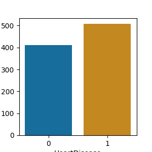
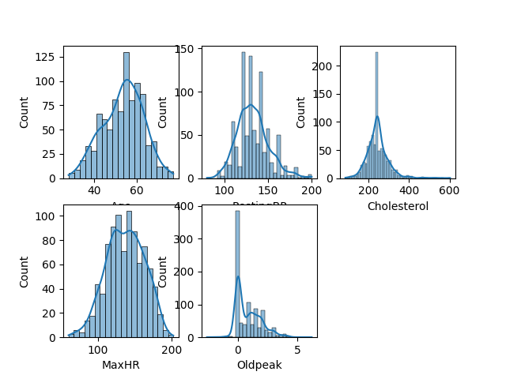
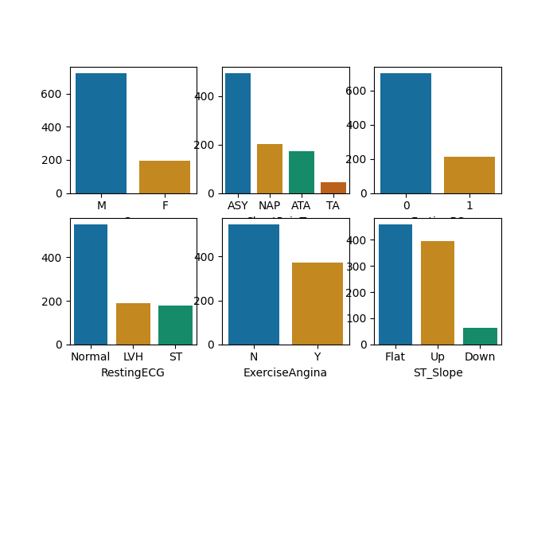
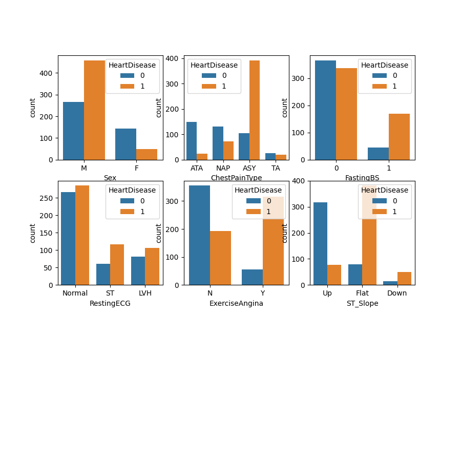
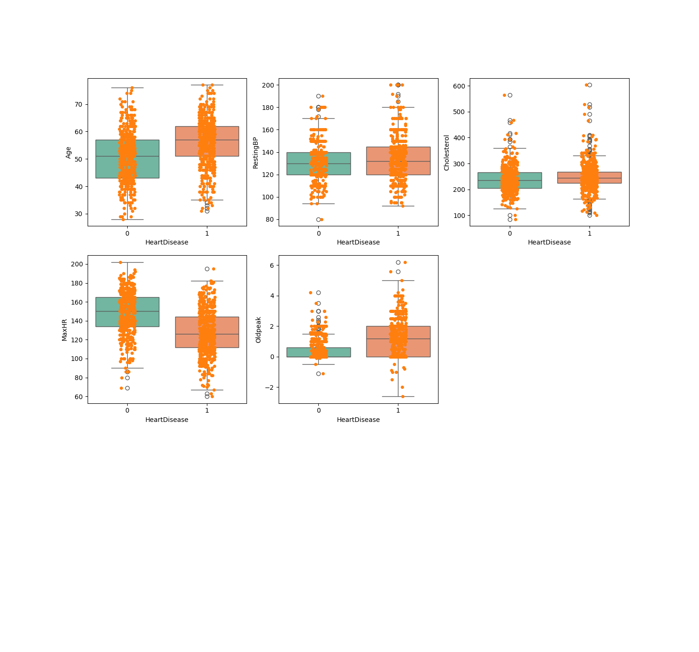
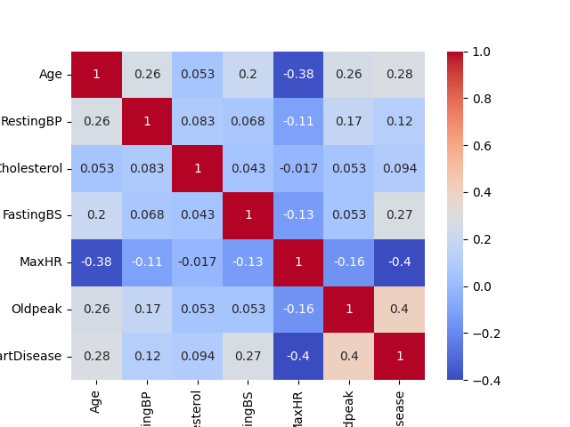
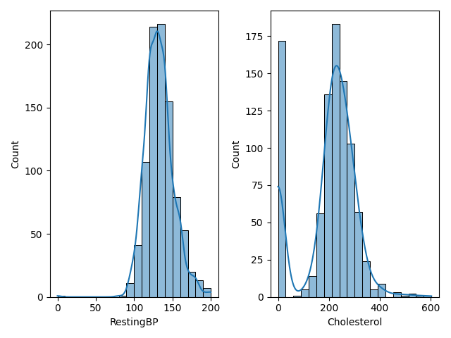
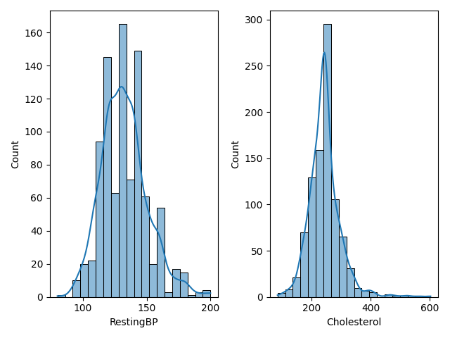
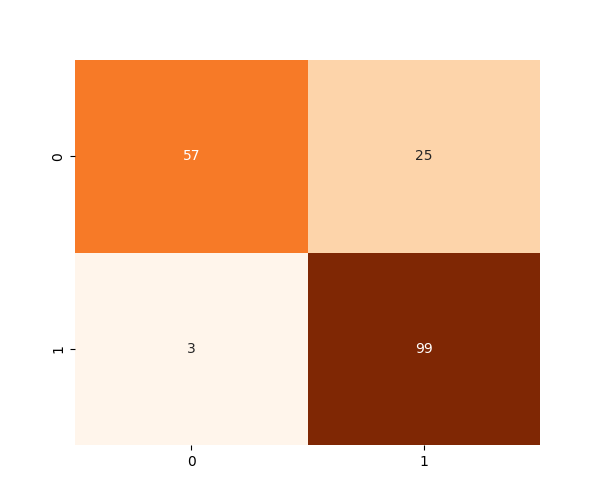

# Heart Disease Classification — ML Pipeline

**Binary cardiac risk prediction using clinical patient parameters.**
Trained on the UCI Heart Disease Dataset across 4 Jupyter Notebooks. Deployed as a decoupled web application — FastAPI on Render, Vanilla HTML/JS on Vercel.

---

## Table of Contents

- [1. Introduction](#1-introduction)
- [2. Application Demonstration](#2-application-demonstration)
- [3. Data Dictionary](#3-data-dictionary)
- [4. Exploratory Data Analysis](#4-exploratory-data-analysis)
- [5. Data Cleaning](#5-data-cleaning)
- [6. Data Preprocessing](#6-data-preprocessing)
- [7. Data Splitting](#7-data-splitting)
- [8. Feature Engineering](#8-feature-engineering)
- [9. Feature Selection](#9-feature-selection)
- [10. Model Training](#10-model-training)
- [11. Model Selection and Evaluation](#11-model-selection-and-evaluation)
- [12. Developer and Connect](#12-developer-and-connect)

---

## 1. Introduction

- **Dataset:** UCI Heart Disease — 918 rows, 11 features, 1 binary target (`HeartDisease`).
- **Notebooks:** EDA → Cleaning → Preprocessing + Feature Engineering + Selection → Model Training.
- **Champion Model:** Random Forest (Gini, 100 estimators) at a custom 35% clinical threshold.
- **Deployment:** Vercel (Frontend) + Render (FastAPI Backend).

**Final Metrics (35% threshold):**

| Accuracy | Recall | Precision | F1-Score | ROC-AUC |
|----------|--------|-----------|----------|---------|
| 88.04%   | 91.18% | 87.74%    | 89.43%   | 93.33%  |

[Back to Table of Contents](#table-of-contents)

---

## 2. Application Demonstration

https://github.com/user-attachments/assets/ad689934-59d9-4019-b163-4d17555da42b

https://github.com/Tanish-30-08-2006/Heart-Disease-Prediction/raw/dev/images-recordings/app_recording.mp4

- Patient intake form with live field validation and cold-start detection.
- Results page renders risk gauge, probability %, feature importance chart, and clinical interpretation.

[Back to Table of Contents](#table-of-contents)

---

## 3. Data Dictionary

| Feature          | Type    | Range (Post-Cleaning) | Notes                                                  |
|------------------|---------|-----------------------|--------------------------------------------------------|
| `Age`            | Integer | 28 – 77               | 60+ flagged as senior risk.                            |
| `Sex`            | String  | M / F                 | Dataset is 79% Male (original study recruitment bias). |
| `ChestPainType`  | String  | ATA, NAP, TA, ASY     | ASY = highest disease rate.                            |
| `RestingBP`      | Integer | 80 – 200 mmHg         | Normal <120. Stage 2 Hypertension ≥140. Zeroes cleaned.|
| `Cholesterol`    | Integer | 85 – 603 mg/dL        | Normal <200. 172 zero-value rows cleaned.              |
| `FastingBS`      | Integer | 0 or 1                | 1 = blood sugar >120 mg/dL.                            |
| `RestingECG`     | String  | Normal, ST, LVH       | ST = possible ischaemia. Low target correlation.       |
| `MaxHR`          | Integer | 60 – 202 bpm          | Sick patients plateau below 140 bpm.                   |
| `ExerciseAngina` | String  | Y / N                 | Y = strong CAD indicator.                              |
| `Oldpeak`        | Float   | -5.0 – 10.0           | Healthy near 0–0.5. Sick cluster 0–3+.                 |
| `ST_Slope`       | String  | Up, Flat, Down        | Flat/Down = high risk. Up = lower risk.                |
| `HeartDisease`   | Integer | 0 / 1                 | **Target.** 55.3% Sick / 44.7% Healthy.               |

[Back to Table of Contents](#table-of-contents)

---

## 4. Exploratory Data Analysis

**Basic Inspection:**
- 918 rows, 12 columns. Zero nulls. Zero duplicates. 5 string columns, 7 numerical.

**Target Distribution:**

- 55.3% Sick / 44.7% Healthy. Acceptable class balance — no SMOTE required.

**Univariate — Quantitative:**

- `RestingBP`: 1 row with value 0. Anomaly.
- `Cholesterol`: 172 rows with value 0. Anomaly.
- `Age`, `MaxHR`: Normally distributed. No anomalies.
- `Oldpeak`: Right-skewed. Extreme values are clinically valid — retained.

**Univariate — Categorical:**

- Sex: ~79% Male. Real-world recruitment bias from source studies.
- ASY is the most frequent `ChestPainType`. Flat is most common `ST_Slope`.

**Bivariate — Categorical vs. Target:**

- ASY chest pain, Male sex, ExerciseAngina=Y, ST_Slope Flat/Down → strongly associated with HeartDisease=1.
- RestingECG → low discriminative power vs. target.

**Bivariate — Quantitative vs. Target (Boxplots):**

- `MaxHR`: Healthy 140–160 bpm. Sick below 140 bpm. Clear separation.
- `Oldpeak`: Healthy near 0. Sick 0–3+. Clear separation.
- `Age`: Healthy 45–55. Sick 55–65.
- `Cholesterol`, `RestingBP`: Minimal group separation. Weak individual predictors.

**Correlation Heatmap:**

| Feature      | Correlation with Target |
|--------------|------------------------|
| Oldpeak      | +0.40 (strongest positive) |
| MaxHR        | -0.40 (strongest negative) |
| Age          | +0.28 |
| FastingBS    | +0.27 |
| RestingBP    | +0.12 |
| Cholesterol  | +0.09 (weakest) |

[Back to Table of Contents](#table-of-contents)

---

## 5. Data Cleaning

**Zero-Value Anomalies:**

| Column       | Zero Rows | % of Dataset | Fix                                      |
|--------------|-----------|--------------|------------------------------------------|
| `Cholesterol`| 172       | 18.7%        | Replaced with mean of non-zero rows: **239.68 mg/dL** |
| `RestingBP`  | 1         | 0.1%         | Replaced with mean of non-zero rows: **132.57 mmHg**  |

### Before Imputation : 

### After Imputation :

- Post-imputation histograms confirmed normal distribution shape preserved for both columns.
- Dropping 172 rows was not viable on a 918-row medical dataset.

**Other Checks:**
- Null values: 0. Duplicates: 0.
- Outliers (`Cholesterol` up to 603, `MaxHR` extremes): all within clinically possible ranges. Retained.
- Saved as: `../data/01_cleaned_heart_data.csv`

[Back to Table of Contents](#table-of-contents)

---

## 6. Data Preprocessing

| Column           | Unique Values         | Encoding           | Mapped Values                         |
|------------------|-----------------------|--------------------|---------------------------------------|
| `Sex`            | 2 (M, F)              | Label Encoding     | M=1, F=0                              |
| `ExerciseAngina` | 2 (Y, N)              | Label Encoding     | Y=1, N=0                              |
| `ChestPainType`  | 4 (ATA, NAP, TA, ASY) | One-Hot Encoding   | ASY dropped (reference). 3 cols created. |
| `RestingECG`     | 3 (Normal, ST, LVH)   | One-Hot Encoding   | LVH dropped (reference). 2 cols created. |
| `ST_Slope`       | 3 (Up, Flat, Down)    | One-Hot Encoding   | Down dropped (reference). 2 cols created. |

- `drop_first=True` used in `pd.get_dummies()` to prevent the Dummy Variable Trap.
- Boolean outputs converted to integers by multiplying DataFrame by 1.

[Back to Table of Contents](#table-of-contents)

---

## 7. Data Splitting

- **Ratio:** 80% Train / 20% Test — `test_size=0.2`, `random_state=42`, `stratify=y`.
- **Stratification result:** 55.3% disease ratio preserved identically across both subsets.

| Subset       | Rows | HeartDisease Ratio |
|--------------|------|--------------------|
| Full Dataset | 918  | 55.3%              |
| Training Set | 734  | ~55.3%             |
| Test Set     | 184  | ~55.3%             |

[Back to Table of Contents](#table-of-contents)

---

## 8. Feature Engineering

All features created on `X_train` first, then applied to `X_test` to prevent data leakage.

| Feature           | Formula                        | Clinical Basis                                              |
|-------------------|--------------------------------|-------------------------------------------------------------|
| `Is_Senior`       | `Age >= 60 → 1, else 0`        | Non-linear risk jump at age 60+.                           |
| `BP_Chol_Risk`    | `RestingBP × Cholesterol`      | Both weak alone (r=0.12, r=0.09). Combined signal stronger. |
| `MaxHR_Deficit`   | `(220 − Age) − MaxHR`          | Measures shortfall vs. age-expected maximum heart rate.     |
| `Is_Hypertensive` | `RestingBP >= 140 → 1, else 0` | Clinical Stage 2 Hypertension boundary.                    |

[Back to Table of Contents](#table-of-contents)

---

## 9. Feature Selection

Four tests run on `X_train` only. Drop rule: **2 or more strikes = dropped.**

**Tests run:**
- **Test 1 — Pearson Correlation:** Pairs with |r| > 0.85 flagged as redundant.
- **Test 2 — Variance Threshold:** Features with variance < 0.01 flagged. All passed — 0 strikes issued.
- **Test 3 — ANOVA F-Test:** Features with p-value > 0.05 flagged.
- **Test 4 — Random Forest Importance:** Features with importance < 0.05 flagged.

**Decision Matrix:**

| Feature              | T1: Redundancy | T2: Variance | T3: F-Test | T4: RF Score | Strikes | Decision |
|----------------------|----------------|--------------|------------|--------------|---------|----------|
| `ST_Slope_Up`        | Pass           | Pass         | Pass       | Pass         | 0       | Keep     |
| `ExerciseAngina_Y`   | Pass           | Pass         | Pass       | Pass         | 0       | Keep     |
| `Oldpeak`            | Pass           | Pass         | Pass       | Pass         | 0       | Keep     |
| `MaxHR`              | Pass           | Pass         | Pass       | Pass         | 0       | Keep     |
| `ChestPainType_ATA`  | Pass           | Pass         | Pass       | Pass         | 0       | Keep     |
| `Age`                | Pass           | Pass         | Pass       | Pass         | 0       | Keep     |
| `Sex_M`              | Pass           | Pass         | Pass       | Pass         | 0       | Keep     |
| `FastingBS`          | Pass           | Pass         | Pass       | Pass         | 0       | Keep     |
| `RestingBP`          | Pass           | Pass         | Pass       | Pass         | 0       | Keep     |
| `RestingECG_Normal`  | Pass           | Pass         | Pass       | Pass         | 0       | Keep     |
| `RestingECG_ST`      | Pass           | Pass         | Pass       | Pass         | 0       | Keep     |
| `ChestPainType_NAP`  | Pass           | Pass         | Pass       | Pass         | 0       | Keep     |
| `BP_Chol_Risk`       | Pass           | Pass         | Pass       | Pass         | 0       | Keep     |
| `Is_Senior`          | Pass           | Pass         | Pass       | **Fail**     | 1       | Keep     |
| `Is_Hypertensive`    | Pass           | Pass         | Pass       | **Fail**     | 1       | Keep     |
| `ST_Slope_Flat`      | **Fail** (r=−0.88 with ST_Slope_Up) | Pass | Pass | Pass | 1+special | **Drop** |
| `Cholesterol`        | **Fail**       | Pass         | **Fail**   | Pass         | 2       | **Drop** |
| `ChestPainType_TA`   | Pass           | Pass         | **Fail**   | **Fail**     | 2       | **Drop** |
| `MaxHR_Deficit`      | **Fail** (derived from MaxHR) | Pass | Pass | Pass | 1+special | **Drop** |

**Final feature count into model training: 15 features.**

[Back to Table of Contents](#table-of-contents)

---

## 10. Model Training

- **Scaling:** `StandardScaler` fitted on `X_train` only. Applied to `X_train` and `X_test`.
- **Scaled columns:** `Age`, `RestingBP`, `MaxHR`, `Oldpeak`, `BP_Chol_Risk`.

**Models trained:**

| Model                        | Key Config                                  |
|------------------------------|---------------------------------------------|
| Logistic Regression          | `random_state=42`                           |
| K-Nearest Neighbours         | Optimal K=11 (found via F1 sweep K=1 to 49) |
| Gaussian Naive Bayes         | Default                                     |
| Decision Tree                | `criterion='entropy'`, `max_depth=5`        |
| Random Forest (Gini)         | `n_estimators=100`, `random_state=42`       |
| Random Forest (Entropy)      | `n_estimators=100`, `random_state=42`       |
| Standard GBM                 | `n_estimators=100`, `learning_rate=0.1`     |
| XGBoost                      | `n_estimators=100`, `learning_rate=0.1`     |
| SVM                          | `kernel='rbf'`, `C=1.0`, `probability=True` |

[Back to Table of Contents](#table-of-contents)

---

## 11. Model Selection and Evaluation

### Baseline Results (Default 50% Threshold)

| Model                         | Accuracy | Recall     | Precision | F1-Score | ROC-AUC |
|-------------------------------|----------|------------|-----------|----------|---------|
| **Random Forest (Gini)**      | 88.04%   | **89.22%** | 89.22%    | **89.22%** | 93.33% |
| K-Nearest Neighbours (K=11)   | 87.50%   | 89.22%     | 88.35%    | 88.78%   | 92.41%  |
| Logistic Regression           | 86.96%   | 89.22%     | 87.50%    | 88.35%   | 92.70%  |
| Support Vector Machine (RBF)  | 86.41%   | 88.24%     | 87.38%    | 87.80%   | 93.64%  |
| Gaussian Naive Bayes          | 89.13%   | 87.25%     | 92.71%    | 89.90%   | 94.01%  |
| Standard GBM                  | 85.87%   | 85.29%     | 88.78%    | 87.00%   | 92.96%  |
| XGBoost                       | 83.15%   | 80.39%     | 88.17%    | 84.10%   | 91.09%  |
| Decision Tree (Depth=5)       | 76.09%   | 79.41%     | 77.88%    | 78.64%   | 81.67%  |

**Selection logic:**
- Primary metric: **Recall** (minimise missed sick patients — False Negatives are dangerous).
- Random Forest, KNN, and Logistic Regression all tied at Recall = **89.22%**.
- Tie-breaker: **F1-Score** → Random Forest highest at 89.22%. **Champion selected.**

### GridSearchCV Tuning

- 108 combinations tested. 5-Fold CV. Scoring: `recall`.
- Result: tuned model Recall dropped from 0.8922 → 0.8725. **Tuned model rejected.**

### Threshold Tuning

**Discovery:** 2 patients had an exact 50/50 tree vote. Default `> 0.50` predicted Healthy for both. Both were actually sick.

| Threshold  | Recall | Precision | F1-Score |
|------------|--------|-----------|----------|
| 50% (>)    | 89.22% | 89.22%    | 89.22%   |
| 50% (>=)   | 91.18% | 87.74%    | 89.43%   |
| 35% (>=)   | 91.18% | 87.74%    | 89.43%   |
| 30% (>=)   | 93.14% | 82.47%    | 87.50%   |
| 25% (>=)   | 95.10% | 78.38%    | 85.96%   |

**Chosen threshold: 35%.** Maximum Recall gain without F1-Score deterioration.

### Final Model (35% Threshold)

| Accuracy | Recall | Precision | F1-Score | ROC-AUC |
|----------|--------|-----------|----------|---------|
| 88.04%   | 91.18% | 87.74%    | 89.43%   | 93.33%  |

[Back to Table of Contents](#table-of-contents)

---

## 12. Developer and Connect

**Tanish Sanghavi** — Machine Learning Engineer

- GitHub: [github.com/Tanish-30-08-2006](https://github.com/Tanish-30-08-2006)
- LinkedIn: [linkedin.com/in/tanish-sanghavi-a44b873b6](https://www.linkedin.com/in/tanish-sanghavi-a44b873b6)

**Dataset:** Janosi et al. (1988). UCI Heart Disease Repository. https://doi.org/10.24432/C52P4X

---

> "Follow the curiosity inside you with dedication."

[Back to Table of Contents](#table-of-contents)
