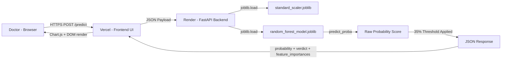

# Heart Disease Classification — Machine Learning Pipeline

**A complete, production-deployed machine learning system for cardiac risk prediction.**

Trained on the UCI Heart Disease Dataset. Built across 4 Jupyter Notebooks covering EDA,
Data Cleaning, Preprocessing, Feature Engineering, Feature Selection, and Model Training.
Deployed as a decoupled web application with a FastAPI backend on Render and a Vanilla HTML
frontend on Vercel.

---

## Table of Contents

- [1. Introduction](#1-introduction)
- [2. Application Demonstration](#2-application-demonstration)
- [3. Data Dictionary and Feature Explanation](#3-data-dictionary-and-feature-explanation)
- [4. Exploratory Data Analysis](#4-exploratory-data-analysis)
- [5. Data Cleaning](#5-data-cleaning)
- [6. Data Preprocessing](#6-data-preprocessing)
- [7. Data Splitting](#7-data-splitting)
- [8. Feature Engineering](#8-feature-engineering)
- [9. Feature Selection](#9-feature-selection)
- [10. Model Training Phase](#10-model-training-phase)
- [11. Model Selection and Evaluation](#11-model-selection-and-evaluation)
- [12. Web Application and Deployment](#12-web-application-and-deployment)
- [13. Developer and Connect](#13-developer-and-connect)

---

## 1. Introduction

**Project Objective:**
- Classify the binary presence of heart disease (0 = Healthy, 1 = Sick) using a patient's clinical parameters.
- Minimise False Negatives — missed sick patients — as the primary engineering objective throughout the pipeline.

**Dataset:**
- Source: UCI Heart Disease Dataset (combined from 5 clinical institutions).
- Size: 918 rows, 11 raw input features, 1 binary target variable (`HeartDisease`).

**Pipeline Summary:**
- Notebook 01: Exploratory Data Analysis (EDA).
- Notebook 02: Data Cleaning (zero-value imputation, outlier review).
- Notebook 03: Preprocessing, Feature Engineering, and Feature Selection.
- Notebook 04: Feature Scaling, Model Training (7 models), Hyperparameter Tuning, Threshold Tuning, and Model Export.

**Final Architecture:**
- Champion model: Random Forest Classifier (Gini, 100 estimators).
- Custom clinical safety threshold: 35% (instead of default 50%).
- Serialized to `.joblib` format for production use.
- Deployed on a decoupled architecture: Vercel (Frontend) + Render (FastAPI Backend).

**Final Champion Metrics (at 35% threshold):**
- Accuracy: 88.04% | Recall: 91.18% | Precision: 87.74% | F1-Score: 89.43% | ROC-AUC: 93.33%

[Back to Table of Contents](#table-of-contents)

---

## 2. Application Demonstration


**What the demo shows:**
- A doctor navigates to the New Assessment page, inputs a patient's 11 clinical values, and submits the form.
- The Results page dynamically renders the risk score gauge (probability percentage), a feature importance bar chart sourced live from the API, and a full clinical interpretation of the prediction.

[Back to Table of Contents](#table-of-contents)

---

## 3. Data Dictionary and Feature Explanation

**Raw dataset:** 918 rows, 11 features, 1 target variable.

| Feature Name     | Data Type   | Description                                                    | Practical / Normal Range       | Clinical Significance                                                                                          |
|------------------|-------------|----------------------------------------------------------------|-------------------------------|----------------------------------------------------------------------------------------------------------------|
| `Age`            | Integer     | Patient age in years.                                          | 28 – 77 (dataset); 20 – 80 typical | Higher age = higher risk. Patients 60+ are considered senior risk. Mean age in dataset: ~54.                  |
| `Sex`            | String      | Biological sex of the patient.                                 | M (Male), F (Female)          | Males have higher prevalence in this dataset (79%). Historically, men develop CAD earlier than women.         |
| `ChestPainType`  | String      | Category of chest pain experienced.                            | ATA, NAP, TA, ASY             | ASY (Asymptomatic) is the most dangerous — patients with ASY have the highest rate of confirmed heart disease. |
| `RestingBP`      | Integer     | Resting blood pressure measured at hospital admission.         | 80 – 200 mmHg (post-cleaning) | Normal: below 120. Stage 2 Hypertension: 140+. Values of 0 are data entry errors (cleaned in Notebook 02).    |
| `Cholesterol`    | Integer     | Serum cholesterol level.                                       | 85 – 603 mg/dL (post-cleaning) | Normal: below 200 mg/dL. High risk: above 240. Values of 0 are missing data (cleaned in Notebook 02).        |
| `FastingBS`      | Integer     | Fasting blood sugar indicator.                                 | 0 or 1                        | 1 = blood sugar > 120 mg/dL. Elevated fasting blood sugar is a significant risk factor for heart disease.     |
| `RestingECG`     | String      | Resting electrocardiogram result.                              | Normal, ST, LVH               | ST-T wave abnormality indicates possible ischaemia. LVH indicates left ventricular hypertrophy.                |
| `MaxHR`          | Integer     | Maximum heart rate achieved during stress test.                | 60 – 202 bpm                  | Healthy patients more easily reach 140–160 bpm. Sick patients often plateau below 140 bpm.                    |
| `ExerciseAngina` | String      | Whether chest pain occurred during exercise.                   | Y (Yes), N (No)               | Y = exercise-induced angina. Strong indicator of coronary artery disease.                                      |
| `Oldpeak`        | Float       | ST depression induced by exercise relative to rest.            | -5.0 – 10.0                   | Higher values indicate greater myocardial ischaemia. Healthy patients cluster near 0–0.5.                      |
| `ST_Slope`       | String      | Slope of the peak exercise ST segment.                         | Up, Flat, Down                | Flat or Downsloping = strong predictor of heart disease. Upsloping = generally lower risk.                     |
| `HeartDisease`   | Integer     | **Target variable.** Presence of heart disease.                | 0 (Healthy), 1 (Sick)         | Class distribution: 55.3% Sick, 44.7% Healthy. Acceptably balanced for model training.                        |

[Back to Table of Contents](#table-of-contents)

---

## 4. Exploratory Data Analysis

### 4.1 Basic Inspection

- **Shape:** 918 rows, 12 columns (11 features + 1 target).
- **Null Values:** Zero null values across all columns. However, null data was disguised as `0` in two numerical columns — detected in Section 4.3.
- **Datatypes:** 5 object (string) columns, 7 numerical columns.
- **Duplicates:** 0 duplicate rows confirmed.

### 4.2 Target Variable Distribution


- Class 0 (Healthy): 44.7% of the dataset.
- Class 1 (Heart Disease): 55.3% of the dataset.
- Distribution is 55/45 — this is acceptable for model training. A ratio worse than 60/40 would require oversampling (SMOTE) or undersampling techniques. No intervention was needed here.

### 4.3 Univariate Analysis — Distribution of Quantitative Variables


- **Age:** Normally distributed between 28 and 77. No anomalies.
- **RestingBP:** Min value = 0. A person cannot have 0 resting blood pressure. Anomaly detected. Approximately **1 row** had this.
- **Cholesterol:** Min value = 0. Serum cholesterol of 0 is physiologically impossible. **172 rows** had this value — representing missing data, not genuine zeroes.
- **MaxHR:** Normally distributed between 60 and 202 bpm. No anomalies.
- **Oldpeak:** Right-skewed. Healthy patients cluster near 0. Outlier-like high values in diseased patients are clinically valid and were retained.

### 4.4 Univariate Analysis — Distribution of Categorical Variables


- **Sex:** Dataset is heavily male-skewed (~79% Male). This reflects the original clinical study recruitment bias — only male patients were enrolled in several of the contributing studies. This is real-world biased data and was noted.
- **ChestPainType:** ASY (Asymptomatic) is the most frequent type.
- **FastingBS:** Most patients have value 0 (blood sugar below 120 mg/dL).
- **RestingECG:** Normal is the most common reading.
- **ExerciseAngina:** More patients did not have exercise-induced angina.
- **ST_Slope:** Flat is the most common slope type.

### 4.5 Bivariate Analysis — Features vs. Target Variable

#### Categorical Features vs. Target:


Key findings:
- **ASY ChestPainType:** Patients with ASY are overwhelmingly likely to have heart disease (1).
- **Male Sex:** Males have significantly higher heart disease rates compared to females in this dataset.
- **ExerciseAngina = Y:** Patients who feel chest pain during exercise are very likely to have heart disease.
- **ST_Slope Flat/Down:** Patients with Flat or Downsloping ST segments are substantially more likely to have heart disease.
- **RestingECG:** Low discriminative power vs. the target variable. Noted for feature selection.

#### Quantitative Features vs. Target (Box Plots):


Key findings:
- **MaxHR:** Healthy patients routinely achieve 140–160 bpm. Sick patients mostly plateau below 140 bpm. Clear separation — strong predictor.
- **Age:** Healthy patients cluster around 45–55. Sick patients cluster around 55–65.
- **Oldpeak:** Healthy patients have near-zero values (0–0.5). Sick patients show a wide spread (0–3+).
- **Cholesterol and RestingBP:** Minimal separation between groups. Both were identified as weak individual predictors.

### 4.6 Correlation Heatmap (Pre-Encoding, Numerical Features Only)


Statistical insights from the heatmap:

- **Oldpeak (+0.40):** Strongest positive numerical correlation with HeartDisease. Higher ST depression is directly associated with higher disease risk.
- **MaxHR (-0.40):** Strongest negative numerical correlation. Lower maximum heart rate is associated with higher disease risk.
- **Age (+0.28):** Moderate positive correlation. Risk increases with age, though the relationship is non-linear (addressed in Feature Engineering with `Is_Senior`).
- **FastingBS (+0.27):** Moderate positive correlation. Elevated fasting blood sugar is a reliable risk indicator.
- **RestingBP (+0.12) and Cholesterol (+0.09):** Very weak individual correlations. Both were weak alone but were combined into the `BP_Chol_Risk` engineered feature in Notebook 03 to test whether their product yielded stronger signal.

[Back to Table of Contents](#table-of-contents)

---

## 5. Data Cleaning

### 5.1 The Problem: Zero Values in RestingBP and Cholesterol

- A person cannot physiologically have a Resting Blood Pressure of 0 mmHg or Serum Cholesterol of 0 mg/dL.
- These zeros represent missing data entries — the original clinical records had no measurement recorded, and the value defaulted to 0.
- **Rows affected:**
  - `Cholesterol = 0`: **172 rows** (~18.7% of the dataset).
  - `RestingBP = 0`: **1 row**.

**Why dropping these rows was not an option:**
- Dropping 172 rows from a dataset of only 918 would eliminate 18.7% of training data. With small medical datasets, every patient record is critical. Dropping them would significantly degrade model performance.

### 5.2 Solution: Conditional Mean Imputation

- Strategy: Replace each `0` value with the **mean of non-zero rows** for that column.
- This avoids distorting the column's true statistical distribution — including the artificial `0` values in the mean calculation would pull the mean downward artificially.

**Computed imputation values:**
- `RestingBP` mean (non-zero rows): **132.57 mmHg**
- `Cholesterol` mean (non-zero rows): **239.68 mg/dL**

**Before Imputation:**


**After Imputation:**


**Why this method worked without distorting the distribution:**

- The zeros were not outliers — they were structurally missing values. Replacing them with the column mean centres new entries at the population average, causing minimal change to the column's standard deviation and overall shape.
- Post-imputation histograms confirmed normal distribution shape was preserved for both `RestingBP` and `Cholesterol`.
- No new artificial peaks or skew were introduced.

### 5.3 Other Cleaning Steps

- **Null Values:** Confirmed zero null values in all columns after imputation.
- **Duplicates:** Confirmed zero duplicate rows. No rows were removed.
- **Outlier Handling:** Outliers in `Cholesterol` (up to 603 mg/dL) and `MaxHR` were reviewed. All extreme values were within clinically possible ranges and were **retained** so the model could learn from them.
- **Cleaned file saved as:** `../data/01_cleaned_heart_data.csv`

[Back to Table of Contents](#table-of-contents)

---

## 6. Data Preprocessing

### 6.1 Encoding Strategy

All 5 categorical (string) columns must be converted to numbers before feeding into any ML algorithm.
The strategy differs by the number of unique values in a column.

| Column           | Unique Values | Encoding Method  | Reason                                                                                          |
|------------------|---------------|------------------|-------------------------------------------------------------------------------------------------|
| `Sex`            | 2 (M, F)      | Label Encoding   | Binary column — 2 values only. Mapped manually: M=1, F=0. No ordinal relationship issue arises. |
| `ExerciseAngina` | 2 (Y, N)      | Label Encoding   | Binary column. Mapped manually: Y=1, N=0.                                                       |
| `ChestPainType`  | 4 (ATA, NAP, TA, ASY) | One-Hot Encoding | Multi-class. Label encoding would create false ordinal relationship (e.g., ASY=3 > ATA=0 is meaningless). |
| `RestingECG`     | 3 (Normal, ST, LVH) | One-Hot Encoding | Multi-class. Same ordinal issue — no meaningful numeric ranking exists between ECG types.       |
| `ST_Slope`       | 3 (Up, Flat, Down) | One-Hot Encoding | Multi-class. Up/Flat/Down have no numeric ranking. One-hot creates independent binary columns. |

### 6.2 Why Label Encoding for Binary Columns

- Two unique values means the encoded result is simply 0 and 1.
- There is no risk of the algorithm interpreting any false magnitude — the difference between 0 and 1 is the same for both values.
- Label encoding binary columns avoids creating unnecessary extra columns.

### 6.3 Why One-Hot Encoding for Multi-Class Columns

- If `ChestPainType` were encoded as ATA=0, NAP=1, ASY=2, TA=3, the algorithm would mathematically interpret TA (3) as three times greater than ATA (0). This is clinically meaningless and causes numerical bias.
- `pd.get_dummies()` with `drop_first=True` was used to prevent the **Dummy Variable Trap** (multicollinearity caused by one redundant column):
  - If a patient has ChestPainType_ATA=0, ChestPainType_NAP=0, and ChestPainType_TA=0, we already know with certainty they are ASY. Keeping the ASY column adds redundant information and causes a mathematical crash in some models.
- Boolean values from `get_dummies()` were converted to integers (0/1) by multiplying the dataframe by 1.

**Columns created after encoding:**

- `ChestPainType_ATA`, `ChestPainType_NAP`, `ChestPainType_TA` (ASY dropped as reference)
- `RestingECG_Normal`, `RestingECG_ST` (LVH dropped as reference)
- `ST_Slope_Flat`, `ST_Slope_Up` (Down dropped as reference)

[Back to Table of Contents](#table-of-contents)

---

## 7. Data Splitting

- **Split ratio:** 80% Training / 20% Testing.
- **Method:** `sklearn.model_selection.train_test_split`
- **Test size:** `test_size=0.2`
- **Random state:** `random_state=42` — ensures the same shuffle pattern is reproduced every time the notebook is run. Without this, results vary on each execution.
- **Stratification:** `stratify=y` — this is critical. Without stratification, a random split could place 70% of sick patients in training and only 30% in testing (or vice versa), creating an imbalanced test set that produces misleading evaluation metrics.

**Split verification:**

| Subset        | Rows  | Heart Disease Ratio |
|---------------|-------|---------------------|
| Full Dataset  | 918   | 55.3%               |
| Training Set  | 734   | ~55.3%              |
| Test Set      | 184   | ~55.3%              |

Stratification confirmed: the 55/45 disease ratio was maintained identically in both training and test sets.

[Back to Table of Contents](#table-of-contents)

---

## 8. Feature Engineering

Four new features were engineered from the training data to capture clinical relationships that raw features could not express alone.
**All features were created on `X_train` first, then applied identically to `X_test` to prevent data leakage.**

| New Feature Name    | Formula / Logic                              | Why It Was Created                                                                                                                                                            |
|---------------------|----------------------------------------------|-------------------------------------------------------------------------------------------------------------------------------------------------------------------------------|
| `Is_Senior`         | `np.where(Age >= 60, 1, 0)`                  | Age has a non-linear relationship with heart disease risk. A patient aged 60+ faces sharply higher risk than one aged 45. A binary flag captures this clinical threshold better than the raw continuous Age value alone. |
| `BP_Chol_Risk`      | `RestingBP * Cholesterol`                    | RestingBP (correlation: +0.12) and Cholesterol (correlation: +0.09) were both weak individual predictors. The hypothesis was that their combined interaction — high BP *and* high cholesterol simultaneously — creates a stronger compound risk signal. The product was tested in ANOVA F-Test and confirmed to be statistically significant. |
| `MaxHR_Deficit`     | `(220 - Age) - MaxHR`                        | A cardiologist's baseline formula: maximum expected heart rate for a healthy person = 220 minus age. The deficit measures how far a patient's actual MaxHR falls below the healthy expectation for their age. A 30-year-old with MaxHR=150 means something very different from a 60-year-old with MaxHR=150. Raw MaxHR alone does not capture this. |
| `Is_Hypertensive`   | `np.where(RestingBP >= 140, 1, 0)`           | Clinical definition: RestingBP >= 140 mmHg = Stage 2 Hypertension. EDA confirmed that sick patients heavily exceeded 140 mmHg, while healthy patients largely stayed below it. This binary flag captures a clinically defined critical boundary. |

[Back to Table of Contents](#table-of-contents)

---

## 9. Feature Selection

Feature selection was a multi-stage, rigorous process using 4 independent statistical and algorithmic tests applied to the training dataset only.
The objective was to drop features that added noise, were redundant with other features, or failed to provide discriminative signal for predicting heart disease.

### 9.1 The Four Tests

**Test 1 — Pearson Correlation Analysis (Redundancy / Multicollinearity Check)**
- Threshold: Any two features with a Pearson correlation above +0.85 or below -0.85 are considered redundant.
- Purpose: Keep one feature from any highly correlated pair, drop the other. Keeping both feeds the same information twice (multicollinearity), which destabilises some algorithms.
- Result: No pair exceeded the ±0.85 threshold in isolation. However, `ST_Slope_Flat` was found to have a **-0.88 correlation with `ST_Slope_Up`** — confirmed as a redundant pair. Additionally, `MaxHR_Deficit` (our engineered feature) was highly correlated with `MaxHR`, since it is derived from it. Similarly, `BP_Chol_Risk` overlapped with its parent features `RestingBP` and `Cholesterol`.

**Test 2 — Variance Threshold Analysis (Low Variance / Near-Constant Feature Check)**
- Threshold: Features where more than 99% of rows have the same value add almost nothing to learning — the model cannot distinguish patients using them.
- Industry standard threshold: variance < 0.01.
- Result: **All features passed Test 2.** No column was found to be near-constant. Zero strikes issued.

**Test 3 — ANOVA F-Test (Statistical Significance vs. Target Variable)**
- Why ANOVA and not Chi-Squared:
  - Chi-Squared is ideally suited for purely categorical columns.
  - All categorical columns had already been encoded to 0/1 integers via Label Encoding and One-Hot Encoding.
  - ANOVA F-Test works correctly on 0/1 binary encoded columns as well as continuous quantitative columns.
  - A single ANOVA F-Test was therefore applied to all columns uniformly, rather than splitting into two separate tests.
- How it works: ANOVA splits each column by the target variable (0=Healthy, 1=Sick), calculates the average value for each group, and measures the gap between the two group means. A large gap = high F-Score = statistically useful feature. A p-value > 0.05 means the difference between groups is not statistically significant (likely random noise).
- Result: Features with p-value > 0.05 were issued a strike.

**Test 4 — Random Forest Feature Importance (Non-Linear Importance via Gini Impurity)**
- Why Random Forest and not Pearson Correlation alone:
  - Pearson Correlation only detects linear relationships. If a feature has a U-shaped or threshold-based relationship with heart disease, Pearson scores it near 0.0 (incorrectly suggesting it is useless), because it cannot draw a straight best-fit line through U-shaped data.
  - Random Forest draws boxes (decision boundaries) around groups of patients rather than fitting a line. It handles non-linear, threshold-based, and complex feature relationships correctly.
- Features with importance score < 0.05 (contributing less than 5% of total chaos reduction across the forest) were issued a strike.
- Result: `Is_Senior` and `Is_Hypertensive` completely failed this test (near-zero importance), and `ChestPainType_TA` also fell below the 0.05 threshold.

### 9.2 Keep / Drop Decision Matrix

The final decision rule: **Drop a feature if it accumulates 2 or more strikes across all 4 tests.**

| Feature              | Test 1: Redundancy | Test 2: Variance | Test 3: F-Test | Test 4: RF Importance | Total Strikes | Decision |
|----------------------|--------------------|------------------|----------------|-----------------------|---------------|----------|
| `ST_Slope_Up`        | Pass               | Pass             | Pass           | Pass                  | 0             | Keep     |
| `ExerciseAngina_Y`   | Pass               | Pass             | Pass           | Pass                  | 0             | Keep     |
| `Oldpeak`            | Pass               | Pass             | Pass           | Pass                  | 0             | Keep     |
| `MaxHR`              | Pass               | Pass             | Pass           | Pass                  | 0             | Keep     |
| `ChestPainType_ATA`  | Pass               | Pass             | Pass           | Pass                  | 0             | Keep     |
| `Age`                | Pass               | Pass             | Pass           | Pass                  | 0             | Keep     |
| `Sex_M`              | Pass               | Pass             | Pass           | Pass                  | 0             | Keep     |
| `FastingBS`          | Pass               | Pass             | Pass           | Pass                  | 0             | Keep     |
| `RestingBP`          | Pass               | Pass             | Pass           | Pass                  | 0             | Keep     |
| `RestingECG_Normal`  | Pass               | Pass             | Pass           | Pass                  | 0             | Keep     |
| `RestingECG_ST`      | Pass               | Pass             | Pass           | Pass                  | 0             | Keep     |
| `ChestPainType_NAP`  | Pass               | Pass             | Pass           | Pass                  | 0             | Keep     |
| `BP_Chol_Risk`       | Pass               | Pass             | Pass           | Pass                  | 0             | Keep     |
| `Is_Senior`          | Pass               | Pass             | Pass           | **Fail**              | 1             | Keep     |
| `Is_Hypertensive`    | Pass               | Pass             | Pass           | **Fail**              | 1             | Keep     |
| `ST_Slope_Flat`      | **Fail**           | Pass             | Pass           | Pass                  | 1+special     | **Drop** |
| `Cholesterol`        | **Fail**           | Pass             | **Fail**       | Pass                  | 2             | **Drop** |
| `ChestPainType_TA`   | Pass               | Pass             | **Fail**       | **Fail**              | 2             | **Drop** |
| `MaxHR_Deficit`      | **Fail**           | Pass             | Pass           | Pass                  | 1+special     | **Drop** |

### 9.3 Detailed Drop Justification

**1. `ST_Slope_Flat` — Dropped (Multicollinearity / Dummy Variable Trap)**
- `ST_Slope_Flat` had a correlation of **-0.88** with `ST_Slope_Up` in Test 1. Knowing a patient had an upsloping ST segment tells you with very high certainty that they did not have a flat segment. Keeping both creates multicollinearity.
- Decision: Keep `ST_Slope_Up` (higher Random Forest importance score, ~22%). Drop `ST_Slope_Flat`.

**2. `Cholesterol` — Dropped (2 Strikes: F-Test + Redundancy)**
- Cholesterol failed the ANOVA F-Test (p-value > 0.05). It was also flagged as redundant in Test 1 because `BP_Chol_Risk` (which contains Cholesterol's signal multiplied with RestingBP) was found to be a stronger combined feature.
- Keeping both `Cholesterol` and `BP_Chol_Risk` is redundant as one is a component of the other.

**3. `ChestPainType_TA` — Dropped (2 Strikes: F-Test + RF Importance)**
- `ChestPainType_TA` (Typical Angina) failed the ANOVA F-Test (p-value > 0.05) and had a Random Forest importance score below the 0.05 threshold. It did not provide statistically significant or non-linear discriminative power vs. the target variable.

**4. `MaxHR_Deficit` — Dropped (Signal Splitting with MaxHR)**
- `MaxHR_Deficit` is mathematically derived from `MaxHR` and `Age`. Keeping both `MaxHR` and `MaxHR_Deficit` splits the same signal across two correlated columns.
- `MaxHR` had a higher F-Score and higher Random Forest importance than `MaxHR_Deficit`. `MaxHR` was retained; `MaxHR_Deficit` was dropped.

**Final feature count going into model training:** 15 features.

[Back to Table of Contents](#table-of-contents)

---

## 10. Model Training Phase

Feature scaling was applied before training. `StandardScaler` was fitted **only on `X_train`** and then applied to both `X_train` and `X_test` using the same mean and standard deviation — this is essential to prevent data leakage.

**Columns scaled:** `Age`, `RestingBP`, `MaxHR`, `Oldpeak`, `BP_Chol_Risk`.
Binary encoded columns (0/1) were not scaled as they already occupy the same unit-less space.

Seven models were trained, evaluated, and compared.

---

### 4.1 Logistic Regression (Linear Baseline)

**Why it was tested:**
- Standard baseline for binary classification. Draws a single straight-line decision boundary between classes using a sigmoid function.
- Provides interpretable feature weights — useful for sanity-checking whether the model is using clinically expected features (which it was: ST_Slope_Up, ExerciseAngina, and Sex had the highest weights).

---

### 4.2 K-Nearest Neighbours (Spatial / Distance Model)

**Why it was tested:**
- KNN classifies patients based on Euclidean distance to the K nearest training patients. No parameters are learned during `.fit()` — it memorises the training data and votes by proximity.
- Particularly useful for detecting local, cluster-based patterns in the data that a global linear model would miss.
- Hyperparameter tuning: optimal K was found by iterating K values from 1 to 49 (odd values only) and selecting the K with the highest F1-Score on the test set. Optimal K = **11**.

---

### 4.3 Naive Bayes — Gaussian NB (Probabilistic Model)

**Why it was tested:**
- Based on Bayes' theorem. Calculates the posterior probability of disease given a set of symptoms.
- Extremely fast. Works well when features are conditionally independent.
- Known limitation for this dataset: `BP_Chol_Risk` violates the independence assumption (it is derived from other features). This was noted and factored into the final selection.

---

### 4.4 Decision Tree — ID3 / CART (Flowchart Model)

**Why it was tested:**
- Directly interpretable visual model — produces a tree of Yes/No clinical questions.
- Useful for stakeholder communication: "If ST_Slope_Up = 0 and ExerciseAngina = 1 and Oldpeak > 1.5, then predict Sick."
- Hyperparameters used: `criterion='entropy'`, `max_depth=5`, `random_state=42`. Max depth was capped at 5 to prevent overfitting.
- Known limitation: Single trees are prone to high variance and rely heavily on the single most informative feature (ST_Slope_Up consumed 50%+ of total information gain), ignoring weaker but still relevant features.

---

### 4.5 Random Forest — Gini and Entropy (Parallel Ensemble Model)

**Why it was tested:**
- Solves the single decision tree's high-variance problem through Bootstrap Aggregation (Bagging):
  - 100 independent trees are built, each on a random bootstrap sample of ~63% unique training patients (sampled with replacement).
  - Each split considers only a random subset of features (approximately square root of total features), forcing each tree to specialise in different feature patterns.
- Both `criterion='gini'` (CART) and `criterion='entropy'` (ID3) variants were trained and compared.
- Gini was selected for final use due to a marginally higher Recall score.

---

### 4.6 Standard Gradient Boosting Machine — GBM (Sequential Ensemble Model)

**Why it was tested:**
- Unlike Random Forest (parallel trees), GBM builds trees sequentially. Each new tree specifically targets and corrects the mathematical residual errors of the previous tree.
- Based on Jerome Friedman's 1999 gradient descent framework applied to decision trees.
- Hyperparameters: `n_estimators=100`, `learning_rate=0.1`, `random_state=42`.

---

### 4.7 XGBoost (Extreme Gradient Boosting)

**Why it was tested:**
- XGBoost (2014, Tianqi Chen) is an optimised, regularised implementation of standard GBM.
- Key improvement: adds a complexity penalty term (Omega) to the loss function. The algorithm actively mathematically punishes itself for building overly deep or complex trees, solving overfitting without needing manual depth limits.
- Generally faster and more regularised than standard GBM.
- Hyperparameters: `n_estimators=100`, `learning_rate=0.1`, `random_state=42`.

---

### 4.8 Support Vector Machine — RBF Kernel (Hyperplane Separator)

**Why it was tested:**
- SVM does not draw a single best-fit line. It constructs the widest possible separating margin (hyperplane) between the Healthy and Sick classes.
- The RBF (Radial Basis Function) kernel was used to handle non-linear separability by projecting data into a higher-dimensional space.
- Ideal for small, clean datasets (under 10,000 rows). Works only on scaled data since its core mathematics rely on Euclidean distance.
- `probability=True` was set to enable ROC-AUC calculation via Platt Scaling.

[Back to Table of Contents](#table-of-contents)

---

## 11. Model Selection and Evaluation

### 11.1 Baseline Model Comparison Matrix

All 8 model variants evaluated on the held-out test set (184 patients) at the default 50% classification threshold:

| Model                          | Accuracy | Recall   | Precision | F1-Score | ROC-AUC |
|-------------------------------|----------|----------|-----------|----------|---------|
| Random Forest (Gini)          | 88.04%   | 89.22%   | 89.22%    | 89.22%   | 93.33%  |
| K-Nearest Neighbours (K=11)   | 87.50%   | 89.22%   | 88.35%    | 88.78%   | 92.41%  |
| Logistic Regression           | 86.96%   | 89.22%   | 87.50%    | 88.35%   | 92.70%  |
| Support Vector Machine (RBF)  | 86.41%   | 88.24%   | 87.38%    | 87.80%   | 93.64%  |
| Gaussian Naive Bayes          | 89.13%   | 87.25%   | 92.71%    | 89.90%   | 94.01%  |
| Standard GBM                  | 85.87%   | 85.29%   | 88.78%    | 87.00%   | 92.96%  |
| XGBoost                       | 83.15%   | 80.39%   | 88.17%    | 84.10%   | 91.09%  |
| Decision Tree (Depth=5)       | 76.09%   | 79.41%   | 77.88%    | 78.64%   | 81.67%  |

### 11.2 Model Selection Logic

**Primary Selection Metric: Recall (Medical Domain Priority)**

- In a healthcare classification setting, the most dangerous error is a **False Negative**: telling a sick patient they are healthy. This patient goes home undiagnosed and may suffer a fatal cardiac event.
- A **False Positive** (telling a healthy patient they may be sick) results in additional precautionary tests — inconvenient, but not life-threatening.
- Recall = TP / (TP + FN) — it directly measures the False Negative rate. Maximising Recall is the primary clinical goal.

**The Three-Way Tie at Recall = 89.22%:**

- Three models tied at the highest Recall score of **0.8922 (89.22%)** at the default threshold:
  - Random Forest (Gini)
  - K-Nearest Neighbours (K=11)
  - Logistic Regression

**Tie-Breaker: F1-Score (Secondary Priority)**

- F1-Score is the harmonic mean of Recall and Precision. It penalises models that achieve high Recall by simply labelling every patient as sick (which would give 100% Recall but 0% Precision).
- Among the three tied models:

| Model                        | F1-Score (Tie-Breaker) |
|------------------------------|------------------------|
| Random Forest (Gini)         | **89.22%**             |
| K-Nearest Neighbours (K=11)  | 88.78%                 |
| Logistic Regression          | 88.35%                 |

- **Random Forest won the tie-breaker with the highest F1-Score of 89.22%.**

**Champion selected: Random Forest (Gini, 100 estimators)**

### 11.3 Hyperparameter Tuning — GridSearchCV

A GridSearchCV was executed to attempt further improvement on Recall.

**Search space (108 combinations total):**

| Hyperparameter      | Values Tested         | What It Controls                                           |
|---------------------|-----------------------|------------------------------------------------------------|
| `n_estimators`      | [100, 200, 300]       | Number of trees in the forest.                              |
| `max_depth`         | [5, 10, 15, None]     | Maximum depth each tree can grow.                          |
| `min_samples_split` | [2, 5, 10]            | Minimum patients required in a node before it can be split.|
| `min_samples_leaf`  | [1, 2, 4]             | Minimum patients required to remain in a final leaf node.  |

- 5-Fold Cross Validation was applied (541 total model builds).
- Scoring criterion: `'recall'` (medical priority).
- **Result: The GridSearch tuned model caused slight validation overfitting, dropping test Recall from 0.8922 to 0.8725 (below baseline). The tuned model was rejected.**

### 11.4 Threshold Tuning — The 50/50 Tie-Breaker Discovery

The default Python `predict()` function uses a 50% confidence threshold: predict Sick only if the model is more than 50% confident. The custom threshold analysis revealed a critical discovery:

**The 50/50 Tie Problem:**
- For exactly 2 patients in the test set, the 100 Random Forest trees tied: 50 trees voted Sick, 50 trees voted Healthy (probability = exactly 0.5000).
- Python's default `predict_proba > 0.50` breaks ties by predicting Healthy.
- Both patients were actually sick. The default threshold missed them both.

**Threshold Tuning Results:**

| Threshold | Recall   | Precision | F1-Score |
|-----------|----------|-----------|----------|
| 50% (>)   | 89.22%   | 89.22%    | 89.22%   |
| 50% (>=)  | 91.18%   | 87.74%    | 89.43%   |
| 45% (>=)  | 91.18%   | 87.74%    | 89.43%   |
| 40% (>=)  | 91.18%   | 87.74%    | 89.43%   |
| 35% (>=)  | 91.18%   | 87.74%    | 89.43%   |
| 30% (>=)  | 93.14%   | 82.47%    | 87.50%   |
| 25% (>=)  | 95.10%   | 78.38%    | 85.96%   |

**Decision: Threshold set at 35%**

- At 35%, Recall was **91.18%** — catching 2 additional sick patients compared to the default 50% threshold.
- The threshold was not pushed further (30%, 25%) because at those levels, Precision drops sharply and the F1-Score deteriorates.
- 35% represents the optimal balance: maximum Recall gain without unacceptable Precision loss.

### 11.5 Final Model Performance (35% Threshold)


| Metric    | Value    |
|-----------|----------|
| Accuracy  | 88.04%   |
| Recall    | 91.18%   |
| Precision | 87.74%   |
| F1-Score  | 89.43%   |
| ROC-AUC   | 93.33%   |

[Back to Table of Contents](#table-of-contents)

---

## 12. Web Application and Deployment

### 12.1 Deployment Architecture



### 12.2 API Response Payload

Every prediction request returns this exact JSON structure:

```json
{
  "prediction": 1,
  "probability": 0.4255,
  "threshold_applied": 0.35,
  "verdict": "High Risk",
  "trees_voted_high_risk": 43,
  "feature_importances": {
    "ST_Slope_Up": 0.2214,
    "ExerciseAngina_Y": 0.1832,
    "Oldpeak": 0.1245,
    "MaxHR": 0.0987,
    "ChestPainType_ATA": 0.0812
  }
}
```

### 12.3 Technology Stack

| Layer          | Technology              | Responsibility                                          |
|----------------|-------------------------|---------------------------------------------------------|
| Frontend       | HTML5, CSS3, JavaScript (ES6+) | Patient intake form, gauge chart, results dashboard. |
| Data Viz       | Chart.js 4.4.1          | Risk gauge, feature importance bar chart.               |
| API Layer      | Python 3.11, FastAPI    | Data validation (Pydantic), prediction execution, CORS. |
| ML Pipeline    | scikit-learn 1.4.2      | StandardScaler, RandomForestClassifier, predict_proba.  |
| Serialization  | Joblib 1.4.2            | Model, scaler, and feature list persistence.            |
| Backend Host   | Render (Free Tier)      | FastAPI web service. Cold start delay: ~50 seconds.     |
| Frontend Host  | Vercel                  | Static file hosting with clean URL routing.             |

### 12.4 Application Pages

| Page              | Path                 | Description                                              |
|-------------------|----------------------|----------------------------------------------------------|
| Disclaimer Gate   | `/`                  | Mandatory acknowledgement modal before access is granted.|
| Dashboard         | `/dashboard`         | KPI cards, demo patient charts, last prediction gauge.   |
| New Assessment    | `/assessment`        | Clinical intake form with live validation checklist.     |
| Results           | `/results`           | Risk gauge, feature importance chart, clinical report.   |
| Methodology       | `/methodology`       | Pipeline diagram, algorithm comparison, threshold logic. |
| About             | `/about`             | Tech stack, dataset citation, academic disclaimer.       |
| Settings          | `/settings`          | Theme toggle, session clear, API heartbeat polling.      |

[Back to Table of Contents](#table-of-contents)

---

## 13. Developer and Connect

**Tanish Sanghavi**
Machine Learning Engineer | Data Science Portfolio Project

- GitHub: [https://github.com/Tanish-30-08-2006](https://github.com/Tanish-30-08-2006)
- LinkedIn: [https://www.linkedin.com/in/tanish-sanghavi-a44b873b6](https://www.linkedin.com/in/tanish-sanghavi-a44b873b6)

**Dataset Citation:**
Janosi, A., Steinbrunn, W., Pfisterer, M., & Detrano, R. (1988).
Heart Disease [Dataset]. UCI Machine Learning Repository.
https://doi.org/10.24432/C52P4X

---

> "Follow the curiosity inside you with dedication."

[Back to Table of Contents](#table-of-contents)